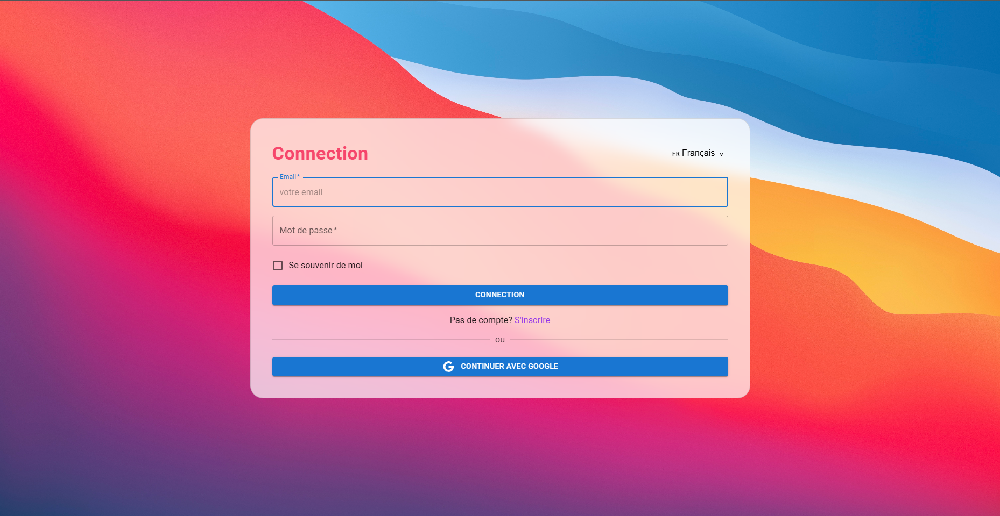
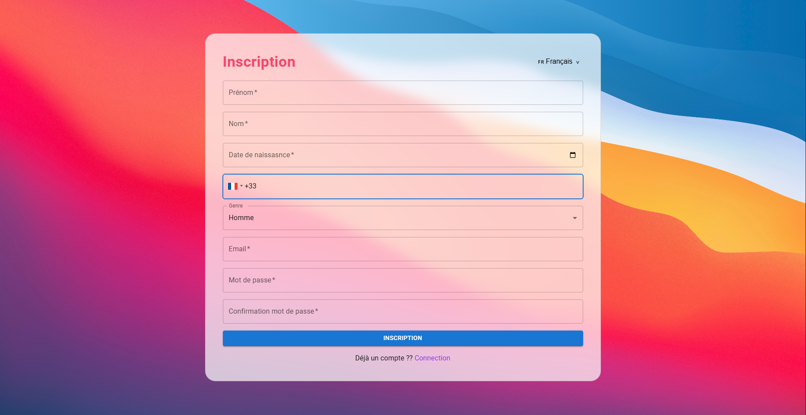
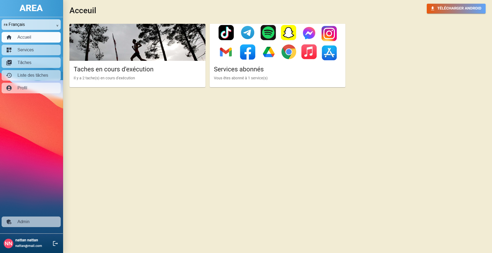
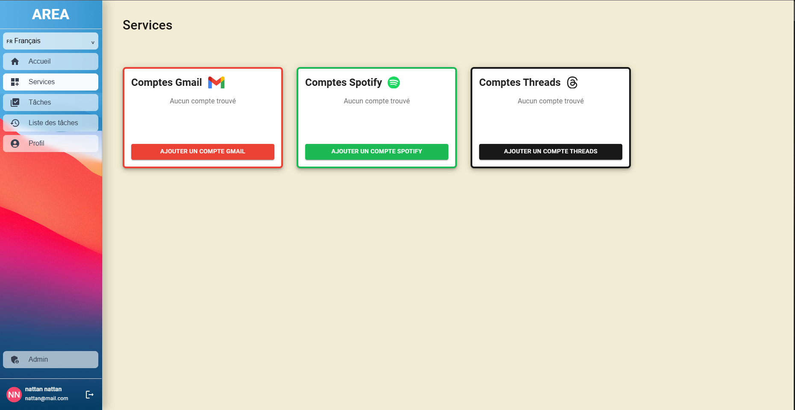
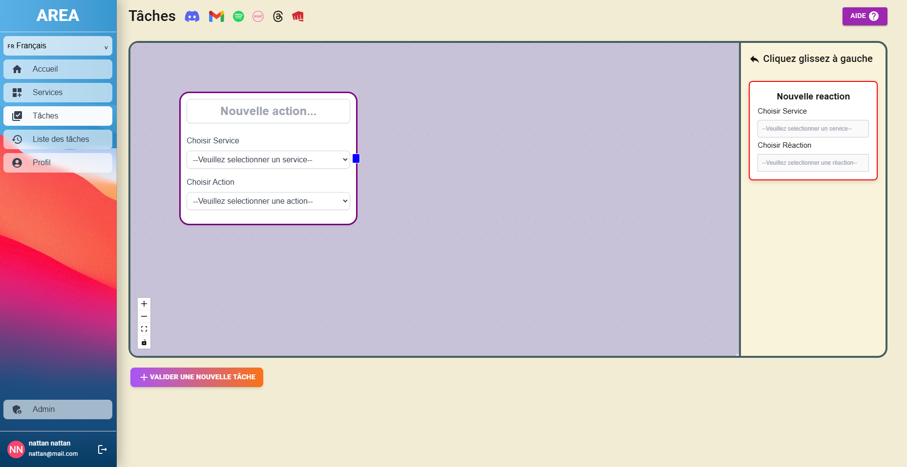
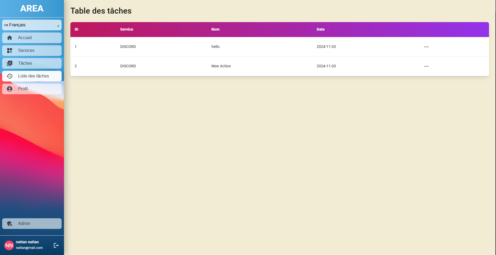
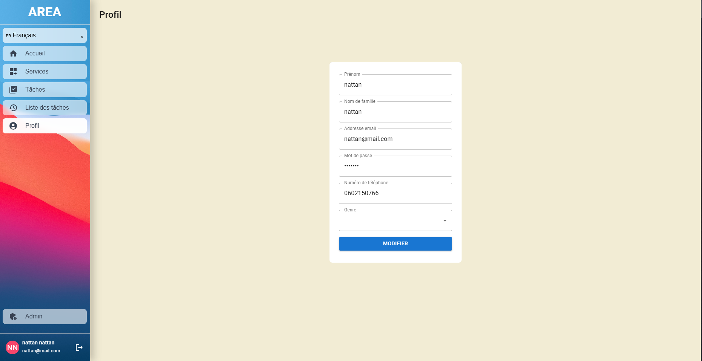
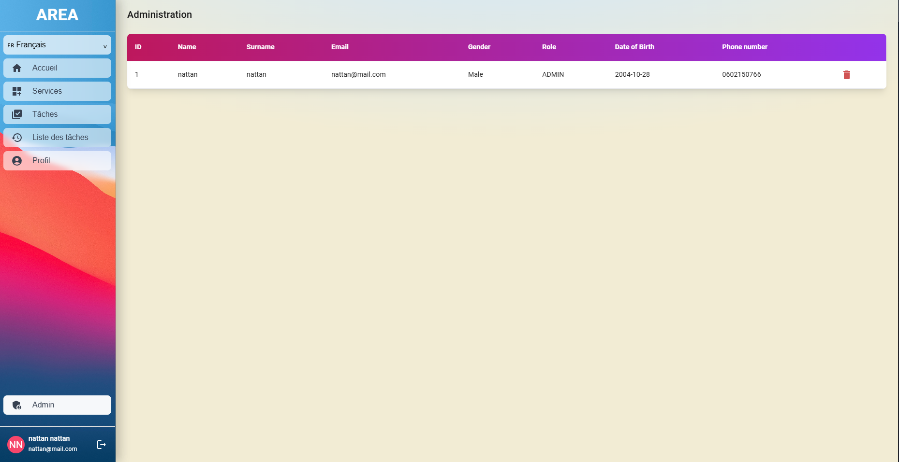

# Mode d'emploi

## Login

Ici on peut se connecter avec un compte déjà crée 

## Signup

Ici on peut se créer un compte

## Accueil

Ici vous pourrez avoir vos données d'actions et de services

## Services

Ici vous pourrez gérer les comptes de services

## Tâches

Ici vous pourrez créer des tâches en utilisant des services

## Tableau des tâches

Ici vous pourrez supprimer et voir les détails des tâches déjà réalisées

## Profil

Ici vous pourrez modifier votre profil

## Admin

Ici vous pourrez gérer les différents utilisateurs

